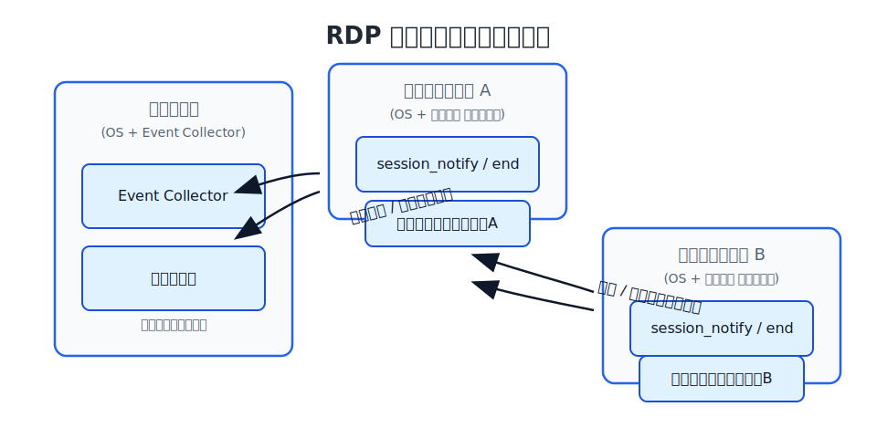

# セッション通知構成の図解プレビュー

ログオンまたはリモートセッション確立時に `session_notify` を送信し、ログオフや切断時に `session_end_event` を送るイベント駆動型の構成を UML 図で確認できるよう、Mermaid のホスティングサービスを利用したリンク付き Markdown を用意しました。

## 配置図 (Deployment Diagram)

オフライン閲覧向けのローカル画像

Mermaid 記法のソースは [`docs/diagrams/heartbeat-deployment.mmd`](./diagrams/heartbeat-deployment.mmd) に保存してあります。

## シーケンス図 (Sequence Diagram)

Mermaid 記法のソースは [`docs/diagrams/heartbeat-sequence.mmd`](./diagrams/heartbeat-sequence.mmd) です。

---

> **補足**: 社内ネットワークやオフライン環境で閲覧する場合は、`docs/diagrams/*.mmd` を元に `@mermaid-js/mermaid-cli` などでローカル生成した画像ファイルに差し替えてください。
