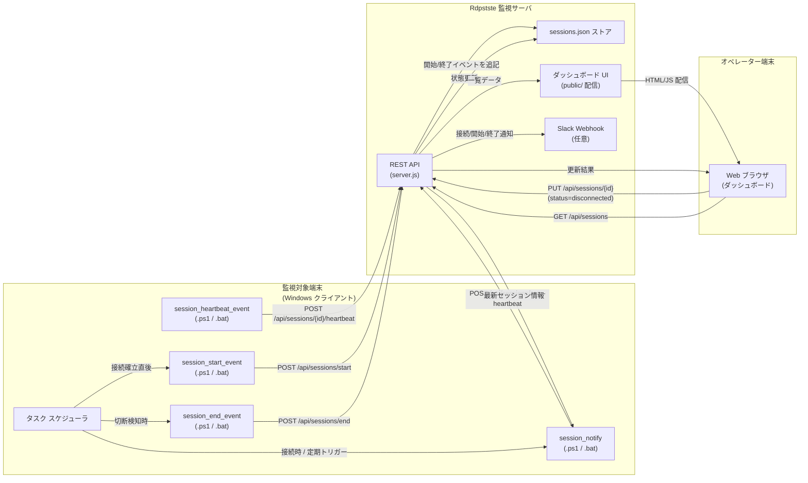
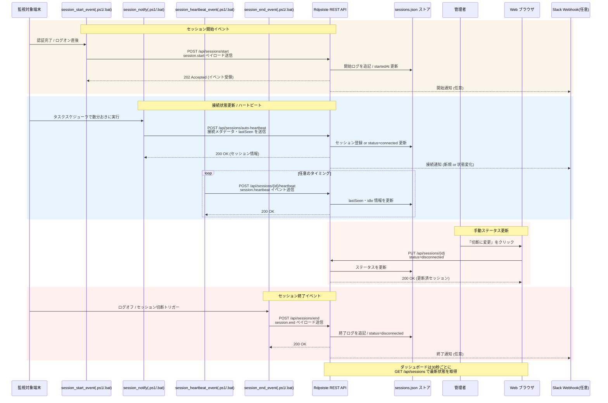

# 接続・切断・ハートビート イベントの図解

Rdpstste で扱う接続・切断・ハートビート、そしてセッション開始・終了イベントがどのように連携するかを、配置図とシーケンス図で整理しました。GitHub が Mermaid をサポートしているため、そのままスクロールするだけで図を表示できます。

## サマリー

- 接続時・定期的なハートビート送信・手動切断に加えて、`session_start_event` / `session_end_event` で収集する開始・終了イベントを図に追加しました。
- 図の元データを Mermaid のソースファイルとして `docs/diagrams/` 以下に保存し、再利用しやすい形にしました。
- 新しい図を本文に埋め込み、ドキュメントを読むだけでイベントの流れを把握できるようにしました。

## 配置図 (Deployment Diagram)

Mermaid 記法のソースは [`docs/diagrams/session-events-deployment.mmd`](./diagrams/session-events-deployment.mmd) に保存しています。図内で参照しているスクリプトやエンドポイントは、`scripts/` ディレクトリの PowerShell / バッチ ファイルと [`server.js`](../server.js) の REST API 実装に対応しています。`session_start_event` と `session_end_event` は、タスク スケジューラなどで接続直後・切断直後に実行し、サーバー側で開始・終了タイムスタンプを記録する想定です。

## シーケンス図 (Sequence Diagram)

シーケンス図の元データは [`docs/diagrams/session-events-sequence.mmd`](./diagrams/session-events-sequence.mmd) です。`session_start_event` は接続直後の開始イベントを記録し、`session_notify` の自動ハートビートや `session_heartbeat_event` の詳細なアイドル情報と組み合わせることで、セッション開始〜継続〜終了のライフサイクルを追跡できます。切断時には `session_end_event` が終了ログと稼働指標 (任意) を送信し、ダッシュボードや Slack 通知に反映されます。
