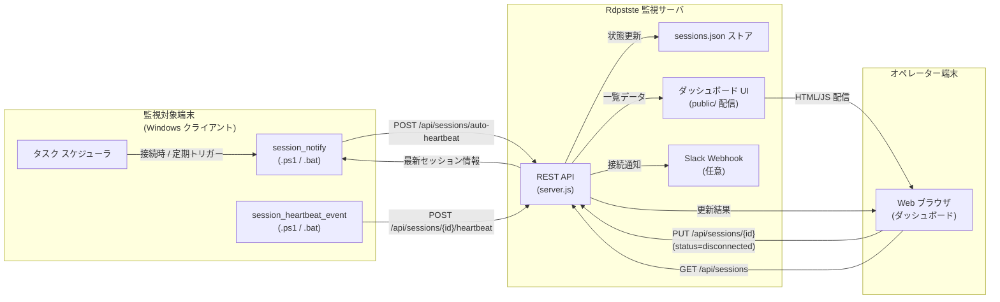
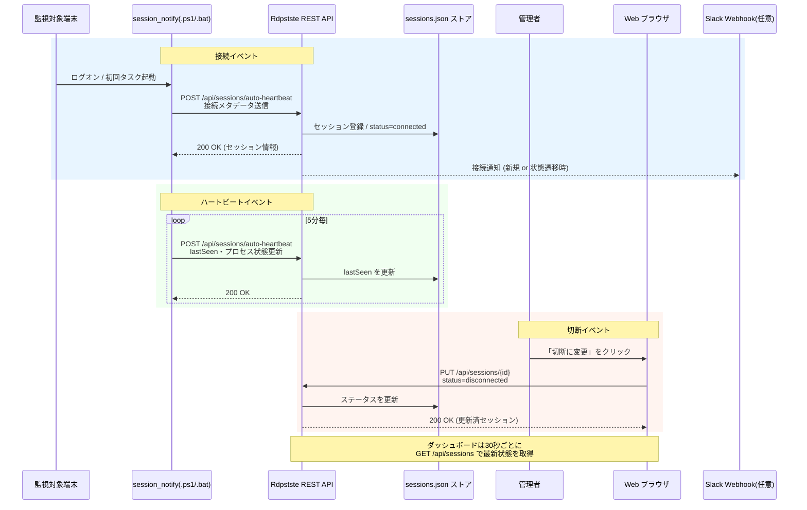

# 接続・切断・ハートビート イベントの図解

Rdpstste で扱う接続・切断・ハートビートの 3 種類のイベントがどのように連携するかを、配置図とシーケンス図で整理しました。GitHub が Mermaid をサポートしているため、そのままスクロールするだけで図を表示できます。

## サマリー

- 接続時・定期的なハートビート送信・手動切断の三つのイベントを対象にした配置図を追加しました。
- 図の元データを Mermaid のソースファイルとして `docs/diagrams/` 以下に保存し、再利用しやすい形にしました。
- 新しい図を本文に埋め込み、ドキュメントを読むだけでイベントの流れを把握できるようにしました。

## 配置図 (Deployment Diagram)

Mermaid 記法のソースは [`docs/diagrams/session-events-deployment.mmd`](./diagrams/session-events-deployment.mmd) に保存しています。図内で参照しているスクリプトやエンドポイントは、`scripts/` ディレクトリの PowerShell / バッチ ファイルと [`server.js`](../server.js) の REST API 実装に対応しています。

## シーケンス図 (Sequence Diagram)

シーケンス図の元データは [`docs/diagrams/session-events-sequence.mmd`](./diagrams/session-events-sequence.mmd) です。接続イベントは `session_notify` の初回送信で新規作成または `connected` への遷移を引き起こし、ハートビートは同スクリプトの定期実行で `lastSeen` を更新します。切断イベントはダッシュボードでの手動操作 (PUT `/api/sessions/{id}`) や、別途自動化したスクリプトからのリクエストで状態を `disconnected` に変更する想定です。

