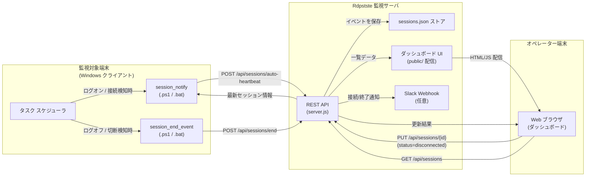
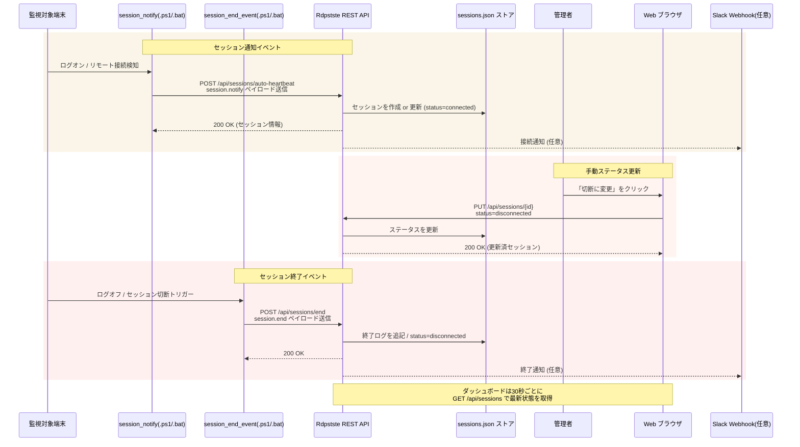
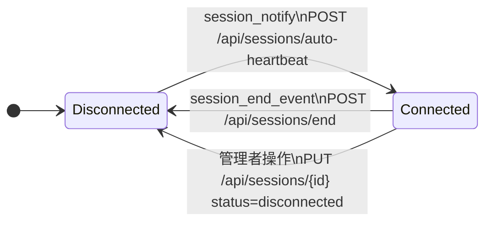

# セッション通知 / 終了イベントの図解

Rdpstste で扱う `session_notify` (ログオン / リモート接続) と `session_end_event` (切断 / ログオフ) がどのように連携するかを、配置図とシーケンス図で整理しました。GitHub が Mermaid をサポートしているため、そのままスクロールするだけで図を表示できます。

## サマリー

- 定期的なハートビートではなく、イベント駆動でセッションの開始と終了を記録する構成に更新しました。
- 図の元データを Mermaid のソースファイルとして `docs/diagrams/` 以下に保存し、再利用しやすい形にしました。
- 新しい図を本文に埋め込み、ドキュメントを読むだけでイベントの流れを把握できるようにしました。

## 配置図 (Deployment Diagram)

Mermaid 記法のソースは [`docs/diagrams/session-events-deployment.mmd`](./diagrams/session-events-deployment.mmd) に保存しています。図内で参照しているスクリプトやエンドポイントは、監視対象端末で動かす `scripts/endpoint/` ディレクトリの PowerShell / バッチ ファイルと、セットアップ用途の `scripts/setup/` 以下に用意した補助ツール、そして [`server.js`](../server.js) の REST API 実装に対応しています。`session_notify` はログオンまたはリモートセッション確立のイベントから実行し、`session_end_event` はログオフやセッション切断の直後に呼び出して終了タイムスタンプを記録します。

## シーケンス図 (Sequence Diagram)

シーケンス図の元データは [`docs/diagrams/session-events-sequence.mmd`](./diagrams/session-events-sequence.mmd) です。`session_notify` はログオンやリモート接続を検知したタイミングでセッション情報をサーバーへ送り、`session_end_event` が終了ログを確実に記録することで、セッションのライフサイクルをイベントだけで追跡できます。手動ステータス変更はバックアップ手段として残し、イベントが届かない場合の補正に活用します。

## 状態遷移図 (State Diagram)

イベント駆動型では「接続中」と「切断済み」をシンプルに扱い、通知から終了までを一意に追跡します。

状態遷移図のソースは [`docs/diagrams/session-state-machine.mmd`](./diagrams/session-state-machine.mmd) に保存しています。イベントが届いたタイミングで状態が遷移するため、定期的なハートビートを待たなくてもログオン直後の状況やログオフ直後の切断がダッシュボードへ即時反映されます。
